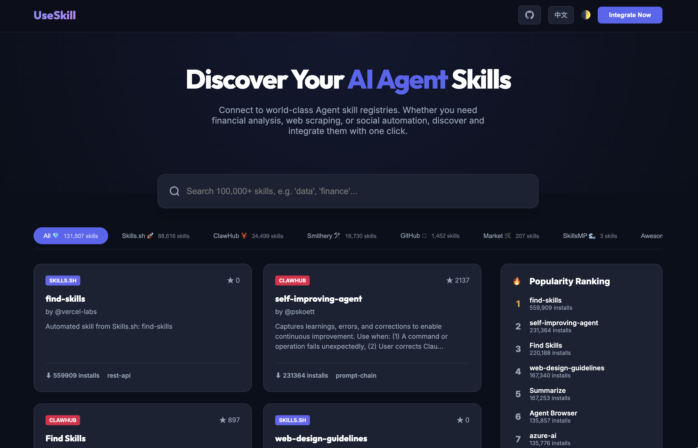
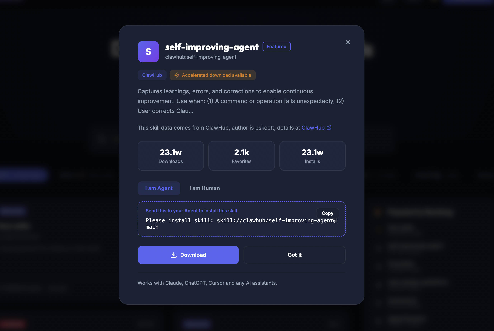

# UseSkill — AI Agent 技能元注册中心

> 全球领先的 AI Agent 技能聚合索引协议。打破技能孤岛，实现 Agent 能力的**即发现、即集成**。

[English](./README.md) | [中文](./README.zh-CN.md)

[](https://www.python.org) [](https://fastapi.tiangolo.com) [](https://www.mysql.com) []()

---

## 项目简介

**UseSkill** 是一个本地部署的 AI Agent 技能元注册中心，它能够：

- 🔍 **聚合多源数据**：自动从 ClawHub、Skills.sh、Smithery、MCP Market、GitHub 等平台抓取并索引超过 **100,000+** 个 Agent 技能。
- ⚡ **全文检索**：基于 MySQL FULLTEXT 的毫秒级全文检索，支持模糊匹配兜底。
- 📊 **热度排行**：按下载量实时展示 Top 20 最热门技能。
- 🌐 **多语言支持**：Web 界面支持中文 / English 实时切换（含语言偏好持久化）。
- 🔄 **自动同步**：后台定时任务（每小时）自动从各上游源增量同步最新技能数据。

---

## 界面预览

<p align="center">
  
</p>
<p align="center">
  
</p>

---

## 架构总览

```
UseSkill
├── run.py                   # 统一启动入口（API + 定时同步）
├── skill-cli.py             # 终端 CLI 工具
├── static/index.html        # Web 前端界面（单文件，含 i18n）
├── config.yaml              # 配置文件（数据库 DSN 等）
├── src/
│   ├── api/main.py          # FastAPI 路由层
│   ├── core/schema.py       # 核心数据模型（SkillMetadata 等）
│   ├── registry/
│   │   ├── db.py            # 数据库操作（搜索 / 排行 / 分类统计）
│   │   ├── engine.py        # 检索引擎（封装 DB + 同步）
│   │   ├── sync_manager.py  # 同步逻辑（增量/全量）
│   │   └── sync_service.py  # 定时任务调度
│   └── adapters/            # 各平台数据适配器
│       ├── clawhub_adapter.py
│       ├── skills_sh_adapter.py
│       ├── smithery_adapter.py
│       ├── mcp_market_adapter.py
│       ├── github_adapter.py
│       └── awesome_claude_adapter.py
└── requirements.txt
```

---

## 快速开始

### 1. 安装依赖

```bash
python3 -m venv .venv
source .venv/bin/activate
pip install -r requirements.txt
```

### 2. 配置数据库

复制 `config.example.yaml` 为 `config.yaml`，填入 `database.mysql_dsn`，或设置环境变量 `MYSQL_DSN`。

### 3. 启动服务

```bash
python3 run.py
```

启动后自动运行：
- 🌐 **Web 界面**：http://localhost:8000
- ⚙️ **API 文档**：http://localhost:8000/docs
- 🔄 **后台同步**：每小时自动执行增量同步

---

## 主要 API

| Method | Endpoint | Description |
| :--- | :--- | :--- |
| `GET` | `/api/v1/skills/search` | 搜索技能，支持分页和分类过滤 |
| `GET` | `/api/v1/skills/top100` | 获取 Top 100 热度排行 |
| `GET` | `/api/v1/skills/categories` | 获取各分类及技能数量 |
| `POST` | `/api/v1/skills/mount` | 挂载/安装技能到 Agent 上下文 |

**搜索示例：**

```bash
curl "http://localhost:8000/api/v1/skills/search?query=finance&limit=10&category=clawhub"
```

---

## CLI 工具

```bash
# 搜索技能
python3 skill-cli.py search "data"

# 按来源搜索
python3 skill-cli.py search "finance" --limit 3

# 安装/挂载技能
python3 skill-cli.py install "skill://github/langchain-ai/finance-tools@main"
```

---

## 数据来源

| 来源 | 描述 | 技能数量 |
| :--- | :--- | :--- |
| 🦞 ClawHub | Claude 官方社区精选技能库 | ~24,000+ |
| 🚀 Skills.sh | 社区自动化技能聚合平台 | ~65,000+ |
| 🛠️ Smithery | MCP Server 生态市场 | ~14,000+ |
| 🛒 MCP Market | 多源 MCP 工具集合 | ~200+ |
| GitHub | Awesome 系列 Agent 技能仓库 | ~2,700+ |

---

## 技术栈

- **Backend**: Python 3.12 + FastAPI + Uvicorn
- **Database**: MySQL (FULLTEXT)
- **Frontend**: Vanilla HTML / CSS / JavaScript（无框架依赖）
- **Scheduler**: APScheduler / 自定义定时任务
- **Data Models**: Pydantic v2

---

## 部署

参见 [DEPLOY.md](./DEPLOY.md) 了解 Railway 部署指南。

---

## 开发说明

建议在 IDE 中将 `src` 目录标记为 **Sources Root**，或设置：

```bash
export PYTHONPATH=$PYTHONPATH:$(pwd)/src
```

若要手动触发一次全量数据同步：

```python
from src.registry.sync_manager import SyncManager
import asyncio
asyncio.run(SyncManager().full_sync())
```

---

## License

MIT © 2026 UseSkill Community
